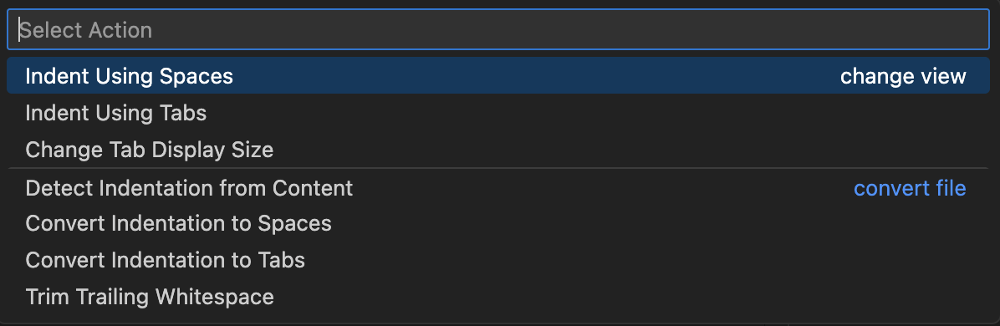

# 🧭 Coding Standards

This guide introduces the **core coding standards** used in our project.
It is written for **new contributors and students**, with the goal of improving **readability, consistency, and maintainability** while keeping the learning curve low.

These standards are **pragmatic, not rigid**: they reflect how the codebase already looks today, and are designed to minimize the effort required when you modify or extend existing code.

---

## 1. Formatting

### 1.1 Indentation & Layout
- Use **4 spaces** for indentation. (Tips: You may change it quickly through VS Code)


- **Do not introduce new tabs**.
- Apply formatting rules only to **new or edited code**, not entire files.

### 1.2 Braces
- Use **K&R style** for new or modified code:
```c
    if (condition) {
        do_something();
    }

    // NOTE ON BRACE PLACEMENT:
    // Do not place the opening brace '{' on a new line. It must remain on the same line as the control statement.
    // Always ensure there is a single space separating the closing parenthesis ')' and the opening brace '{'.
```

Incorrect examples: 
```c
if (condition){
    func(); 
}
```

```c
if (condition)
{
    func();
}
```

* Existing files may use other styles — do not reformat them wholesale.

### 1.3 Line Length & Whitespace

* Soft limit: **~100 characters per line**.
* Use a space after control keywords: `if (`, `for (`, `switch (`.
* No space before function call parentheses: `foo(bar)`.

---

## 2. Naming Conventions

### 2.1 Functions & Variables

* Use **snake_case** for functions and variables:

  ```c
  init_cmd_server();
  packet_length;
  ```

### 2.2 Types & Enums

* Types use the `*_t` suffix:

  ```c
  typedef struct { ... } packet_t;
  ```
* Enums should be consistent within a module (`*_t` or `*_e`).

### 2.3 Macros & Constants

* Use **UPPER_SNAKE_CASE**:

  ```c
  #define MAX_PACKET_SIZE 128
  ```

### 2.4 Globals

* Avoid global variables.
* If unavoidable, **prefix with the module name**:

  ```c
  cmd_server_state;
  sd_card_ready;
  ```

---

## 3. Headers & Includes

### 3.1 Include Order

In `.c` files:

1. The file’s **own header**
2. C standard headers
3. BSP / FreeRTOS headers
4. Project headers

### 3.2 Header Responsibilities

* Headers expose **public APIs only** (types + function prototypes).
* Internal helpers should be `static` and remain in `.c` files.
* New headers must have **unique header guards**.

---

## 4. Module Structure

* Each module (folder) should have **one clear public header**.
* The module that creates an RTOS object (task, queue, buffer) is its **owner**.
* Avoid scattering `extern` declarations across unrelated modules.

---

## 5. FreeRTOS & Concurrency

* Avoid accidental infinite blocking.
* Use **named timeout constants** instead of magic numbers.
* Prefer **queues or message buffers** over shared memory.
* Shared data must be **mutex-protected and documented**.

---

## 6. Data Structures & Protocols

* Use **fixed-width types** (`uint8_t`, `uint16_t`, etc.) for on-wire or hardware data.
* Do not use magic numbers — define constants.
* Make **endianness and packing assumptions explicit** when relevant.

---

## 7. Error Handling

* Do not silently ignore return values.
* Errors should be logged where feasible (with a module tag if available).
* Be consistent within a module in how errors are reported.

---

## 8. Commit Message Conventions

Clear commit messages make collaboration and code review much easier.

### 8.1 Commit Message Format

Follow this structure:

```
<type>: <short summary>

(optional body)
```

Example:

```
fix: handle timeout in cmd_server receive loop
```

### 8.2 Common Commit Types

* `feat:` – new feature
* `fix:` – bug fix
* `refactor:` – code change without behavior change
* `docs:` – documentation only
* `test:` – adding or updating tests
* `chore:` – tooling, build, or maintenance work

### 8.3 General Rules

* Use the **imperative mood** (“add”, not “added”).
* Keep the summary concise (≈50 characters).
* One commit = one logical change.

(Reference: [https://se-education.org/guides/conventions/git.html](https://se-education.org/guides/conventions/git.html))

---

## 9. Useful Links

- [Comments](https://se-education.org/guides/conventions/java/basic.html#comments)
- [Layout](https://se-education.org/guides/conventions/java/basic.html#layout)


---

